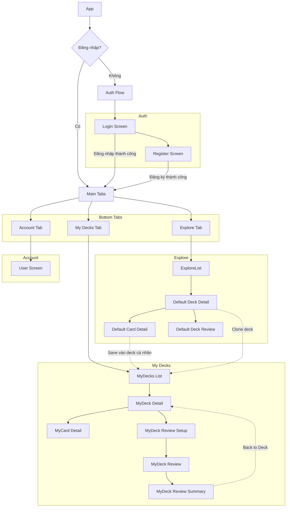

#UIT 
_____
# Giới thiệu đồ án 

Trong bối cảnh giáo dục và tự học hiện đại, việc tiếp thu và lưu trữ kiến thức dài hạn là một yêu cầu nền tảng nhưng cũng đầy thách thức. Các nghiên cứu về tâm lý học nhận thức, đặc biệt là "đường cong lãng quên" của Ebbinghaus, đã chỉ ra rằng con người có xu hướng quên thông tin theo thời gian nếu không có sự củng cố định kỳ. Các phương pháp học tập truyền thống thường không giải quyết triệt để được vấn đề này, dẫn đến hiệu quả ghi nhớ không cao.

Để giải quyết thách thức trên, đề tài này tập trung vào việc thiết kế và xây dựng một hệ thống hỗ trợ học tập ứng dụng phương pháp Lặp Lại Ngắt Quãng (Spaced Repetition System - SRS). Mục tiêu chính là tối ưu hóa quá trình ghi nhớ của người dùng bằng cách cá nhân hóa lộ trình ôn tập.

Hệ thống cho phép người dùng tạo ra các bộ thẻ học (flashcards) kỹ thuật số. Dựa trên sự tương tác và kết quả tự đánh giá của người dùng trong các phiên ôn tập, một thuật toán lõi sẽ phân tích và xác định mức độ thông thạo đối với từng đơn vị kiến thức. Từ đó, hệ thống sẽ tự động lên lịch và ưu tiên hiển thị những kiến thức mà người dùng sắp quên vào thời điểm tối ưu nhất. Đề tài cũng nghiên cứu việc tích hợp nhiều phương pháp ôn tập đa dạng như trắc nghiệm và điền vào chỗ trống để tăng cường sự tương tác và hiệu quả.

Sản phẩm của đề tài mang ý nghĩa thực tiễn, cung cấp một công cụ linh hoạt, giúp người học củng cố kiến thức một cách bền vững và nâng cao hiệu quả trong việc tự học.

## Cập nhật UI gần đây
- Thêm logo ứng dụng hiển thị ở đầu các màn hình Đăng nhập/Đăng ký (sử dụng ảnh `src/logo.png`, căn giữa, co giãn không vỡ hình).
- Ngăn bàn phím che mất ô nhập liệu: các màn hình Đăng nhập/Đăng ký được bọc `KeyboardAvoidingView` + `ScrollView`, cho phép cuộn khi bàn phím mở.
- Tất cả form trong modal (Chỉnh sửa hồ sơ, Đổi mật khẩu, Tạo/Sửa Bộ thẻ/Thẻ) cũng tránh bàn phím nhờ `KeyboardAvoidingView` tích hợp sẵn trong `ModalBase`.


# Giới thiệu lý thuyết và công nghệ sử dụng  

### **1. Hệ thống lặp lại ngắt quãng - Spaced Repetition System (SRS)**

`Spaced Repetition System` (SRS), hay Hệ thống Lặp lại Ngắt quãng, là một phương pháp học tập dựa trên bằng chứng khoa học nhằm giải quyết vấn đề ghi nhớ thông tin dài hạn. Nền tảng của phương pháp này đến từ nghiên cứu của nhà tâm lý học Hermann Ebbinghaus về "đường cong lãng quên" (`forgetting curve`), một biểu đồ cho thấy khả năng lưu giữ thông tin của con người giảm dần theo thời gian theo một hàm số mũ nếu không có sự ôn tập.

SRS hoạt động bằng cách chống lại đường cong này một cách hiệu quả. Thay vì ôn tập một cách ngẫu nhiên, hệ thống sẽ theo dõi hiệu suất của người học đối với từng đơn vị kiến thức. Nó sẽ tính toán và dự đoán thời điểm tối ưu mà người học sắp quên một thông tin, và hiển thị lại thông tin đó ngay trước thời điểm đó. Các khoảng thời gian giữa những lần ôn tập sẽ ngày càng dài ra khi người học chứng tỏ mình đã nắm vững kiến thức. Quá trình này, được gọi là `active recall` (chủ động gợi nhớ), giúp củng cố các liên kết thần kinh một cách mạnh mẽ hơn nhiều so với việc chỉ đọc lại một cách thụ động.

Bằng cách cá nhân hóa lịch trình ôn tập cho từng thẻ bài, SRS đảm bảo rằng người học dành nhiều thời gian hơn cho những kiến thức khó và ít thời gian hơn cho những gì họ đã biết rõ, từ đó tối ưu hóa đáng kể hiệu quả học tập.

![[Pasted image 20250809144744.png]]


### **2. cơ sở dữ liệu phi quan hệ (Non-relational database)**

Cơ sở dữ liệu (`database`) là nền tảng của mọi ứng dụng phần mềm, và trong lịch sử, mô hình quan hệ (`SQL`) đã chiếm ưu thế. Mô hình này tổ chức dữ liệu trong các bảng có cấu trúc chặt chẽ với các hàng và cột, được định nghĩa bởi một `schema` (lược đồ) cố định. Tuy nhiên, với sự phát triển của các ứng dụng web hiện đại, nhu cầu về sự linh hoạt và khả năng mở rộng đã dẫn đến sự ra đời của cơ sở dữ liệu phi quan hệ, hay còn gọi là `NoSQL`.

Không giống như `SQL`, một `non-relational database` không yêu cầu một `schema` cứng nhắc. Thay vào đó, nó lưu trữ dữ liệu dưới các định dạng linh hoạt hơn, phổ biến nhất là mô hình hướng tài liệu (`document-oriented`). Trong mô hình này, mỗi bản ghi là một "tài liệu" độc lập, thường ở định dạng `JSON` (JavaScript Object Notation) hoặc `BSON` (Binary JSON), chứa tất cả thông tin liên quan đến nó. Ví dụ, thông tin của một người dùng, bao gồm các bộ bài và thẻ bài của họ, có thể được lồng vào nhau trong cùng một tài liệu.

Cách tiếp cận này mang lại hai lợi ích chính: sự linh hoạt trong việc phát triển (dễ dàng thêm các trường dữ liệu mới mà không cần thay đổi toàn bộ cấu trúc) và khả năng mở rộng theo chiều ngang một cách hiệu quả, rất phù hợp cho các hệ thống có lượng dữ liệu lớn và cấu trúc phức tạp, thay đổi liên tục.

![[Pasted image 20250811175141.png]]

### **3. Kiến trúc RESTful API**

`API` (Application Programming Interface) là một tập hợp các quy tắc và giao thức cho phép các ứng dụng phần mềm khác nhau giao tiếp với nhau. Trong đó, `REST` (Representational State Transfer) là một kiểu kiến trúc (`architectural style`) cực kỳ phổ biến để thiết kế các `API` trên nền tảng web, và một `API` tuân thủ các nguyên tắc của `REST` được gọi là `RESTful API`.

Kiến trúc `RESTful` hoạt động dựa trên một số nguyên tắc cốt lõi. Quan trọng nhất là nguyên tắc `stateless` (phi trạng thái), nghĩa là máy chủ không lưu trữ bất kỳ thông tin nào về trạng thái của client giữa các yêu cầu. Mỗi yêu cầu từ client phải chứa tất cả thông tin cần thiết để máy chủ có thể hiểu và xử lý nó. Điều này giúp hệ thống trở nên đơn giản và dễ dàng mở rộng.

`REST` tận dụng các phương thức tiêu chuẩn của giao thức `HTTP` để thực hiện các hành động trên tài nguyên (`resource`). Các `resource` này được xác định bởi các `endpoint` (URL). Có thể hình dung các `HTTP methods` như những động từ và `endpoint` như những danh từ:
*   `GET`: Lấy thông tin về một tài nguyên (ví dụ: lấy danh sách các bộ bài).
*   `POST`: Tạo một tài nguyên mới (ví dụ: tạo một người dùng mới).
*   `PUT` / `PATCH`: Cập nhật một tài nguyên đã có.
*   `DELETE`: Xóa một tài nguyên.

Kiến trúc này tạo ra một giao diện rõ ràng, nhất quán và dễ dự đoán cho việc tương tác giữa client và server.

![[Pasted image 20250811175252.png]]

### **4. Giới thiệu về JSON Web Token (JWT)**

Một trong những thách thức của kiến trúc `RESTful API` là tính `stateless`. Nếu máy chủ không nhớ client là ai, làm thế nào để nó xác thực (`authentication`) và cấp quyền (`authorization`) cho các yêu cầu? `JSON Web Token` (JWT) ra đời để giải quyết chính xác vấn đề này.

`JWT` là một tiêu chuẩn mở (RFC 7519) định nghĩa một phương thức nhỏ gọn và khép kín để truyền tải thông tin an toàn giữa các bên dưới dạng một đối tượng `JSON`. Thông tin này có thể được xác minh và tin cậy vì nó đã được ký điện tử.

Một `JWT` bao gồm ba phần được phân tách bởi dấu chấm (`.`):
1.  **Header**: Chứa thông tin về thuật toán được sử dụng để ký token, ví dụ như `HMAC SHA256` hoặc `RSA`.
2.  **Payload**: Chứa các "claims", là những thông tin về một thực thể (thường là người dùng) và các dữ liệu bổ sung. Ví dụ, `payload` có thể chứa `userId`, tên người dùng, và thời gian hết hạn của token.
3.  **Signature**: Để tạo ra chữ ký, ta cần mã hóa `header`, `payload`, một "secret key" (khóa bí mật) chỉ có server biết, và sau đó đưa chúng qua thuật toán đã được chỉ định trong `header`.

Khi client gửi một yêu cầu kèm `JWT`, server sẽ sử dụng `secret key` của mình để xác minh chữ ký. Nếu chữ ký hợp lệ, server có thể tin tưởng rằng `payload` không hề bị thay đổi và tiến hành xử lý yêu-cầu. Điều này cho phép xác thực mà không cần lưu trữ session trên server.

![[Pasted image 20250811175353.png]]

### **5. MongoDB**

`MongoDB` là một hệ quản trị cơ sở dữ liệu `NoSQL` mã nguồn mở hàng đầu, thuộc loại cơ sở dữ liệu hướng tài liệu (`document-oriented`). Thay vì lưu trữ dữ liệu trong các bảng và hàng như cơ sở dữ liệu quan hệ, `MongoDB` lưu trữ các cấu trúc dữ liệu dưới dạng các tài liệu giống `JSON`, được gọi là `BSON` (Binary JSON). Các tài liệu này được nhóm lại trong các `collection`, có vai trò tương tự như các bảng trong `SQL`.

Mỗi tài liệu (`document`) trong một `collection` có thể có cấu trúc hoàn toàn khác nhau, mang lại sự linh hoạt tối đa trong việc lưu trữ dữ liệu phi cấu trúc hoặc bán cấu trúc. `Schema` linh hoạt này cho phép các nhà phát triển dễ dàng thay đổi và phát triển ứng dụng mà không cần phải thực hiện các thao tác di chuyển dữ liệu (`migration`) phức tạp.

`MongoDB` được thiết kế với khả năng mở rộng theo chiều ngang (`horizontal scaling`) làm trọng tâm, cho phép nó xử lý các tập dữ liệu khổng lồ và khối lượng công việc lớn bằng cách phân phối dữ liệu trên nhiều máy chủ, một quá trình được gọi là `sharding`. Sự kết hợp giữa tính linh hoạt, hiệu suất và khả năng mở rộng làm cho `MongoDB` trở thành một lựa chọn cực kỳ phổ biến cho các ứng dụng web hiện đại, đặc biệt là khi được sử dụng cùng với `Node.js`.

![[Pasted image 20250811175437.png]]

### **6. ExpressJS**

`Express.js`, hay đơn giản là `Express`, là một `framework` ứng dụng web tối giản và linh hoạt dành cho `Node.js`. Nó không áp đặt một cấu trúc cứng nhắc mà thay vào đó cung cấp một bộ tính năng mạnh mẽ để phát triển các ứng dụng web và `API` một cách nhanh chóng và dễ dàng. `Express` được xem là `framework` tiêu chuẩn trên thực tế cho việc phát triển backend bằng `Node.js`.

Chức năng cốt lõi của `Express` xoay quanh việc xử lý các yêu cầu `HTTP` và định tuyến (`routing`). Nó cho phép các nhà phát triển xác định các `route` để xử lý các yêu cầu đến các `endpoint` (URL) cụ thể với các `HTTP method` khác nhau (GET, POST, v.v.).

Một trong những khái niệm mạnh mẽ nhất của `Express` là hệ thống `middleware`. `Middleware` là các hàm có quyền truy cập vào đối tượng yêu cầu (`request`), đối tượng phản hồi (`response`), và hàm `next` trong chu trình yêu cầu-phản hồi của ứng dụng. Các hàm này có thể thực hiện các tác vụ như ghi log, xác thực người dùng, phân tích cú pháp `body` của yêu cầu, và xử lý lỗi. Kiến trúc dựa trên `middleware` này cho phép tạo ra một pipeline xử lý yêu cầu rất linh hoạt và có khả năng tái sử dụng cao.

![[Pasted image 20250811175552.png]]

### **7. Giới thiệu ReactJS**

`ReactJS`, thường được gọi là `React`, là một thư viện `JavaScript` mã nguồn mở được phát triển bởi Facebook, chuyên dùng để xây dựng giao diện người dùng (`User Interface` - UI), đặc biệt là cho các ứng dụng một trang (`Single-Page Application` - SPA). `React` không phải là một `framework` hoàn chỉnh mà tập trung hoàn toàn vào lớp `View` trong mô hình `MVC`.

Triết lý cốt lõi của `React` là xây dựng `UI` từ các mảnh ghép độc lập và có thể tái sử dụng được gọi là `component`. Mỗi `component` quản lý `state` (trạng thái) của riêng nó và khi `state` thay đổi, `React` sẽ tự động cập nhật và render lại `component` đó một cách hiệu quả.

Một trong những cải tiến kỹ thuật quan trọng nhất của `React` là `Virtual DOM` (DOM ảo). Thay vì thao tác trực tiếp trên `DOM` thật của trình duyệt (một quá trình rất chậm), `React` duy trì một bản sao của `DOM` trong bộ nhớ. Khi một `component` cần cập nhật, `React` sẽ so sánh `Virtual DOM` mới với phiên bản cũ, tính toán sự khác biệt tối thiểu (`diffing algorithm`), và sau đó chỉ cập nhật những phần thực sự thay đổi trên `DOM` thật. Điều này giúp tối ưu hóa đáng kể hiệu suất.

Ngoài ra, `React` sử dụng `JSX` (JavaScript XML), một phần mở rộng cú pháp cho phép viết mã trông giống `HTML` ngay bên trong `JavaScript`, giúp việc mô tả `UI` trở nên trực quan và dễ đọc hơn.

![[Pasted image 20250811175719.png]]

### **8. Giới thiệu Node.js**

`Node.js` là một môi trường thực thi (`runtime environment`) `JavaScript` mã nguồn mở, đa nền tảng, cho phép các nhà phát triển chạy mã `JavaScript` ở phía máy chủ (`server-side`), bên ngoài trình duyệt. Nó được xây dựng trên `V8 JavaScript engine` của Chrome, công cụ đã được tối ưu hóa cao về hiệu suất.

Điểm khác biệt lớn nhất của `Node.js` so với các môi trường server-side truyền thống khác là mô hình `I/O` (Input/Output) không đồng bộ và hướng sự kiện (`event-driven, non-blocking I/O`). Trong các mô hình truyền thống, khi một yêu cầu cần thực hiện một tác vụ `I/O` (như đọc file hoặc truy vấn cơ sở dữ liệu), luồng (`thread`) xử lý sẽ bị chặn lại cho đến khi tác vụ hoàn thành. Ngược lại, `Node.js` sử dụng một luồng sự kiện (`event loop`) duy nhất. Khi một tác vụ `I/O` được yêu cầu, `Node.js` sẽ gửi yêu cầu đó đi và ngay lập tức tiếp tục xử lý các yêu cầu khác. Khi tác vụ `I/O` hoàn thành, một sự kiện sẽ được đưa vào `event loop` và một hàm `callback` tương ứng sẽ được thực thi.

Mô hình này giúp `Node.js` xử lý hàng nghìn kết nối đồng thời với hiệu suất rất cao và chi phí tài nguyên thấp, làm cho nó trở thành một lựa chọn lý tưởng để xây dựng các ứng dụng mạng có khả năng mở rộng, đặc biệt là các `RESTful API`, ứng dụng thời gian thực và `microservice`.

![[Pasted image 20250811175817.png]]

### **9. Giới thiệu mô hình MVC**

`MVC` (Model-View-Controller) là một mẫu kiến trúc phần mềm (`architectural pattern`) được sử dụng rộng rãi để tổ chức mã nguồn của một ứng dụng thành ba phần có liên quan với nhau. Mục tiêu chính của `MVC` là tách biệt giữa logic nghiệp vụ (`business logic`) và giao diện người dùng (`user interface`), giúp cho ứng dụng trở nên dễ quản lý, bảo trì và phát triển hơn.

Ba thành phần của mô hình `MVC` bao gồm:
1.  **Model**: Là thành phần chịu trách nhiệm quản lý dữ liệu và logic nghiệp vụ của ứng dụng. Nó tương tác trực tiếp với cơ sở dữ liệu, thực hiện các thao tác như truy vấn, thêm, sửa, xóa dữ liệu. `Model` không biết gì về cách dữ liệu sẽ được hiển thị. Nó chỉ cung cấp dữ liệu khi `Controller` yêu cầu.
2.  **View**: Là thành phần chịu trách nhiệm hiển thị dữ liệu cho người dùng, tức là giao diện người dùng (UI). `View` nhận dữ liệu từ `Controller` và trình bày nó một cách trực quan. `View` không chứa bất kỳ logic nghiệp vụ nào; nhiệm vụ của nó chỉ đơn thuần là hiển thị.
3.  **Controller**: Đóng vai trò là trung gian giữa `Model` và `View`. Nó nhận các yêu cầu đầu vào từ người dùng (thông qua `View`), sau đó tương tác với `Model` để xử lý các yêu cầu đó (ví dụ: lấy dữ liệu hoặc cập nhật dữ liệu). Cuối cùng, `Controller` chọn một `View` thích hợp và truyền dữ liệu cần thiết cho `View` đó để hiển thị kết quả cho người dùng.

Sự phân tách rõ ràng này giúp các nhà phát triển có thể làm việc song song trên các thành phần khác nhau mà không ảnh hưởng lẫn nhau.

![[Pasted image 20250811180031.png]]

## 10. Lý thuyết phương thức stateless 

Phương thức/Kiến trúc API stateless là khi server không lưu trữ thông tin của tương tác người dùng với ứng dụng. Mọi tương tác và yêu cầu của 

Thông thường, đối với phương thức stateful, server phải lưu trạng thái và thông tin của người dùng bằng session để thực hiện các phương thức cần được cấp quyền.

Tuy nhiên, đối với kiến trúc stateless, server chỉ cần một web token (JWT) để xác thực người dùng và phiên đăng nhập của họ. Mỗi API request đều có thể độc lập với nhau thay vì phải diễn ra theo đúng thứ tự. 

**Ví dụ**:

Người dùng nhấn "Bắt đầu ôn tập". Frontend gửi yêu cầu kèm theo JWT trong header.

2. Load balancer nhận được yêu cầu, thấy rằng Server A đang bận, nhưng server B đang rảnh. Nó sẽ gửi yêu cầu đến Máy chủ B.
3. Máy chủ B chưa từng thấy người dùng này trước đây. Nhưng cũng không quan trọng. Nó chỉ cần đọc JWT, thấy được userId bên trong, và tiến hành lấy đúng các thẻ bài từ cơ sở dữ liệu để tạo ra phiên ôn tập.
4. Người dùng trả lời một thẻ bài. Yêu cầu tiếp theo được gửi đến load balancer, và lần này nó được chuyển đến Máy chủ C.
5. Server C cũng không có ký ức nào về người dùng, nhưng nó cũng không cần. Server C xác thực JWT và xử lý yêu cầu.

Vì vậy, kiến trúc stateless thường nhanh và dễ mở rộng. Một server không cần phải xác thực người dùng trong session, mà có thể thực hiện ngay các yêu cầu của người dùng 

![[Pasted image 20250811175942.png]]

# Phân tích hệ thống 

## Yêu cầu chức năng - technical functional requirement 

Tiểu mục này sẽ phác thảo các thông số kỹ thuật và thiết kế cho một ứng dụng web flashcard đơn giản nhưng hiệu quả và ngắn gọn. Mục tiêu chính là cung cấp cho người học ngôn ngữ một công cụ hiệu quả để học và ghi nhớ từ vựng cũng như các khái niệm thông qua phương pháp lặp lại ngắt quãng (spaced repetition).

Ứng dụng được xây dựng trên một nền tảng JavaScript hiện đại:
- **Cơ sở dữ liệu:** MongoDB, được lưu trữ trên MongoDB Atlas gói miễn phí, chỉ cung cấp 500mb cho database.
- **Backend/API:** Một RESTful API không trạng thái (stateless) được xây dựng bằng Express.js.
- **Frontend:** Một ứng dụng web được xây dựng bằng React.js.
- **Cloud Hosting**: Cơ sở hạ tầng của ứng dụng được lưu trữ hoàn toàn trên các dịch vụ đám mây, bao gồm:
	1. **Cloud Atlas** cho quản lý và lưu trữ dữ liệu.
	2. **Github** cho việc lưu trữ và quản lý phiên bản mã nguồn.
	3. **Render** cho việc Build, Deploy và Host hệ thống backend 
	4. **Cloudinary** cho việc lưu trữ và cung cấp API cho các file phương tiện (hình hành, gif, video) được người dùng đăng tải lên ứng dụng trang web.
	5. **Netlify** cho việc đăng tải nội dung và giao diện trang web, đồng thời quản lý tên miền của ứng dụng.

Nguyên tắc kiến trúc cốt lõi là một API stateless, đảm bảo hiệu quả, khả năng mở rộng và sử dụng tối ưu tài nguyên cơ sở dữ liệu hạn chế của gói miễn phí bằng cách chuyển việc quản lý phiên (session) cho ứng dụng phía client.

### 2. Các chức năng người dùng

#### 2.1. Người dùng truy cập ứng dụng

- **Tạo tài khoản:** Người dùng mới có thể đăng ký bằng tên người dùng (username) duy nhất, email hợp lệ và mật khẩu. Sau khi đăng ký, người dùng sẽ được tự động đăng nhập vào tài khoản mới.
- **Đăng nhập:** Người dùng đã đăng ký có thể đăng nhập để truy cập vào các bộ thẻ và thẻ cá nhân của họ. Người dùng cũng có thể đăng xuất, cập nhật tài khoản hoặc thậm chí xóa tài khoản của mình.

#### 2.2. Quản lý tài khoản

- **Thay đổi thông tin người dùng**: Người dùng có thể thay đổi username, tên tài khoản, email, và mật khẩu.
- **Xóa tài khoản**: Người dùng có thể xóa vĩnh viễn tài khoản và các thông tin liên quan của họ.

#### 2.3. Quản lý bộ thẻ (Deck):
- **Xem các bộ thẻ:** Sau khi đăng nhập, người dùng sẽ thấy một bảng điều khiển chứa tất cả các bộ thẻ đã tạo của họ.
- **Tạo bộ thẻ:** Người dùng có thể tạo một bộ thẻ mới bằng cách cung cấp một tên duy nhất và mô tả tùy chọn.
- **Chỉnh sửa/Xóa bộ thẻ:** Người dùng có thể đổi tên, thay đổi mô tả hoặc xóa vĩnh viễn bất kỳ bộ thẻ nào của họ. Việc xóa một bộ thẻ cũng sẽ xóa tất cả các thẻ bên trong nó.

#### 2.4. Quản lý thẻ (Card):
- **Xem thẻ:** Khi chọn một bộ thẻ, người dùng có thể xem tất cả các thẻ chứa trong đó.
- **Tạo thẻ:** Người dùng có thể thêm thẻ mới vào một bộ thẻ, cung cấp tên (từ/thuật ngữ), định nghĩa, gợi ý tùy chọn và các danh mục tùy chọn.
- **Chỉnh sửa/Xóa thẻ:** Người dùng có thể chỉnh sửa bất kỳ trường nào trên một thẻ hiện có hoặc xóa một hoặc nhiều thẻ khỏi một bộ thẻ.

#### 2.3. Khám phá các thẻ mẫu/mặc định

- **Khám phá các danh sách từ vựng**: Người dùng sau khi đăng nhập không cần tạo thẻ, mà vẫn có thể xem các mẫu danh sách từ vựng và flashcard bên trong đó. Những thẻ và bộ bài này không thể bị người dùng xóa hay chỉnh sửa. 
- **Sao chép danh sách từ vựng mẫu vào danh sách từ vựng cá nhân**: Người dùng có thể sao chép. 
- **Sao chép một thẻ cụ thể vào danh sách cá nhân**: người dùng có thể sao chép một hoặc nhiều thẻ vào một danh sách từ vựng cá nhân mà họ đã tạo trước đó. 
- **Thực hiện phiên học tập**: Người dùng có thể vào phiên học tập ngay tại list mặc định. Tuy nhiên, kết quả của phiên học tập sẽ không ảnh hưởng đến tần số xuất hiện say này của các thẻ, các thẻ trong phiên học tập cũng sẽ không được cung cấp 3 kết quả submit (khó/trung bình/dễ).

#### 2.4. Phiên học tập - Review Session 

- **Cấu hình:** Người dùng chọn một bộ thẻ và bắt đầu một phiên học tập. Họ có thể cấu hình các phương pháp ôn tập nào sẽ được bao gồm và số lượng thẻ cần ôn tập cho mỗi phương pháp.
  - Ôn tập bộ thẻ (flashcards tiêu chuẩn)
  - Câu hỏi trắc nghiệm (MCQ)
  - Điền vào chỗ trống
- **Thực hiện:** Phiên học bắt đầu, trình bày các phương pháp ôn tập đã chọn theo trình tự.
  - **Ôn tập bộ thẻ:** Tên của một thẻ được hiển thị. Người dùng có thể tùy chọn tiết lộ gợi ý. Họ phải tự đánh giá khả năng nhớ lại của mình bằng cách chọn Dễ, Trung bình hoặc Khó. Sau đó, định nghĩa của thẻ sẽ được tiết lộ. Người dùng nhấn xác nhận để chuyển sang thẻ tiếp theo.
  - **MCQ:** Tên của một thẻ được hiển thị cùng với một số tùy chọn định nghĩa (một đúng, các tùy chọn khác từ các thẻ ngẫu nhiên trong cùng một bộ thẻ). Người dùng chọn một câu trả lời trong tổng số 4. 
  - **Điền vào chỗ trống:** Người dùng được hiển thị tên hoặc định nghĩa và phải nhập vào phần tương ứng. 
  - Điền vào chỗ trống và MCQ chỉ có đúng hoặc sai, không được hiển thị gợi ý, trong khi flashcard có thể là dễ, trung bình hoạc khó, người dùng có thể chọn hiển thị gợi ý.  
- **Hoàn thành:** 
	- Phiên học kết thúc khi tất cả các thẻ đã được cấu hình đã được ôn tập hoặc nếu người dùng thoát sớm. Một báo cáo sẽ được hiển thị tóm tắt hiệu suất cho mỗi phương pháp (ví dụ: số lượng D/TB/K cho Ôn tập bộ thẻ, số lượng đúng/sai cho MCQ và Điền vào chỗ trống).
	- Đối với những thẻ mà người dùng đã nhớ tốt (chọn easy hoặc trả lời đúng tới lần thứ 2), hệ thống sẽ gợi ý người dùng loại bỏ những thẻ đó ra khỏi những phiên học tập sau này.

### 3. Yêu cầu chức năng kỹ thuật

#### 3.1. Chung

- Hệ thống sẽ sử dụng cơ sở dữ liệu MongoDB có tên là "flashcardapps".
- Backend sẽ là một ứng dụng Express.js cung cấp các endpoint (endpoint) RESTful API.
- Tất cả việc truyền dữ liệu giữa client và server sẽ sử dụng JSON.

#### 3.2. Quản lý người dùng

- Hệ thống sẽ cung cấp một endpoint để đăng ký người dùng mới. Tên người dùng và email phải là duy nhất trên toàn hệ thống.
- Mật khẩu phải được băm (hash) an toàn bằng bcrypt trước khi được lưu trữ trong cơ sở dữ liệu. Mật khẩu dạng văn bản thuần túy không bao giờ được lưu trữ.
- Hệ thống sẽ cung cấp một endpoint để xác thực người dùng, khi thành công, sẽ trả về một JSON Web Token (JWT) để sử dụng trong các yêu cầu đã xác thực tiếp theo.

#### 3.3. Quản lý bộ thẻ & Thẻ

- Các endpoint API phải thực thi quyền sở hữu. Một người dùng chỉ có thể xem, tạo, chỉnh sửa hoặc xóa các bộ thẻ và thẻ của chính họ.
- Thuộc tính `size` của một bộ thẻ phải được API tự động cập nhật mỗi khi một thẻ được thêm vào hoặc xóa khỏi bộ thẻ đó.
- Tên bộ thẻ phải là duy nhất cho mỗi người dùng.

#### 3.4. Phiên ôn tập - review session 

- API để bắt đầu một phiên ôn tập stateless.
  - Ban đầu, API sẽ nhận một `deckId` và các cài đặt (ví dụ: `{ review: 10, mcq: 5 }`).
  - Sau đó, API sẽ lấy fetch tất cả các thẻ cho bộ thẻ, thực hiện lựa chọn ngẫu nhiên có trọng số (weighted selection, VD: thẻ mà người dùng thường quên sẽ có trọng số cao và được ưu tiên chọn hơn) dựa trên tần suất của thẻ và trả về một revie session chỉnh, được tạo sẵn (một danh sách các thẻ/câu hỏi) cho client. Server sẽ không lưu trữ kế hoạch phiên học này.
- API để gửi kết quả ôn tập cho một thẻ duy nhất.
  - Ban đầu, API sẽ nhận một `cardId` và kết quả của người dùng (ví dụ: `{ retrievalLevel: 'hard', hintWasShown: true }`).
  - Sau đó API sẽ áp dụng logic `adjustLvl` của backend để cập nhật điểm tần suất (`frequency`) của thẻ trong cơ sở dữ liệu.
  - `retrievalLevel` và `hintWasShown` là các tham số tạm thời và sẽ không được lưu trữ trong cơ sở dữ liệu.

### 4. Thuật ngữ và database schema 

Cơ sở dữ liệu `flashcard-app` sẽ chứa các collection sau:

#### 4.1. Collection `users`

Lưu trữ thông tin cho mỗi người dùng đã đăng ký.

| Tên trường | Kiểu dữ liệu | Ràng buộc / Mô tả |
| :--- | :--- | :--- |
| `_id` | ObjectId | Khóa chính, tự động tạo. |
| `username` | String | Bắt buộc, Duy nhất. Dùng để đăng nhập. |
| `name` | String | Bắt buộc. Tên hiển thị cho giao diện người dùng. |
| `email` | String | Bắt buộc, Duy nhất. Dùng để quản lý tài khoản. |
| `passwordHash` | String | Bắt buộc. Mật khẩu người dùng đã được băm bằng bcrypt. |
| `emailConfirmed` | Boolean | Mặc định: `false`. Cho tính năng xác minh email trong tương lai. |
| `createdAt` | Date | Dấu thời gian tự động tạo khi người dùng được tạo. |

#### 4.2. Collection `decks`
Lưu trữ các bộ thẻ do người dùng tạo, là nơi chứa các thẻ.

| Tên trường    | Kiểu dữ liệu | Ràng buộc / Mô tả                                                      |
| :------------ | :----------- | :--------------------------------------------------------------------- |
| `_id`         | ObjectId     | Khóa chính, tự động tạo.                                               |
| `user_id`     | ObjectId     | Bắt buộc, Có chỉ mục (Indexed). Khóa ngoại tham chiếu đến `users._id`. |
| `name`        | String       | Bắt buộc. Tên của bộ thẻ.                                              |
| `description` | String       | Mô tả tùy chọn về nội dung của bộ thẻ.                                 |
| `size`        | Number       | Mặc định: `0`. Số lượng thẻ được phi chuẩn hóa trong bộ thẻ.           |
| `createdAt`   | Date         | Dấu thời gian tự động tạo.                                             |
| `updatedAt`   | Date         | Dấu thời gian tự động tạo, được cập nhật khi có sửa đổi.               |
| `URL`         | String       | Lưu Trữ hình ảnh tại một URL của một dịch vụ hosting                   |


#### 4.3. Collection `cards`

Lưu trữ các thẻ flashcard riêng lẻ.

| Tên trường   | Kiểu dữ liệu | Ràng buộc / Mô tả                                                        |
| :----------- | :----------- | :----------------------------------------------------------------------- |
| `_id`        | ObjectId     | Khóa chính, tự động tạo.                                                 |
| `deck_id`    | ObjectId     | Bắt buộc, Có chỉ mục (Indexed). Khóa ngoại tham chiếu đến `decks._id`.   |
| `name`       | String       | Bắt buộc. "Mặt trước" của thẻ (thuật ngữ).                               |
| `definition` | String       | Bắt buộc. "Mặt sau" của thẻ (ý nghĩa).                                   |
| `hint`       | String       | Gợi ý tùy chọn để giúp người dùng nhớ lại định nghĩa.                    |
| `word_type`  | String       | Từ loại tiếng anh (noun, adj, adv...)                                    |
| `example`    | [String]     | Một mảng các chuỗi ví dụ của thẻ.                                        |
| `category`   | [String]     | Một mảng các chuỗi cho chủ đề của thẻ.                                   |
| `URL`        | String       | Lưu Trữ hình ảnh tại một URL của một dịch vụ hosting                     |
| `isArchived` | Boolean      | Xác định thẻ có được đưa vào cho các phiên học tập không                 |
| `frequency`  | Number       | Bắt buộc. Tối thiểu: 1, Tối đa: 5, Mặc định: 3. Điểm lặp lại ngắt quãng. |
| `createdAt`  | Date         | Dấu thời gian tự động tạo.                                               |
| `updatedAt`  | Date         | Dấu thời gian tự động tạo, được cập nhật khi có sửa đổi.                 |

### 5. Logic nội bộ chính

Phần này mô tả logic nghiệp vụ quan trọng, được chạy ở dưới phần backend cho các tính năng của ứng dụng.

#### 5.1. `adjustLvl` (Logic cập nhật tần suất thẻ)
Logic này được thực thi bởi endpoint `POST /api/cards/:cardId/submit-result`. Nó lấy tần suất hiện tại của thẻ, mức độ nhớ lại của người dùng (D/TB/K) và liệu gợi ý có được hiển thị hay không để tính toán tần suất mới.

- **Khi Gợi ý được HIỂN THỊ:**
  - Nếu người dùng nhấp vào Dễ (E): Tần suất không được điều chỉnh.
  - Nếu người dùng nhấp vào Trung bình (M): Tần suất tăng thêm 1.
  - Nếu người dùng nhấp vào Khó (H): Tần suất tăng thêm 2.
- **Khi Gợi ý KHÔNG được HIỂN THỊ:**
  - Nếu người dùng nhấp vào Dễ (E): Tần suất giảm đi 1.
  - Nếu người dùng nhấp vào Trung bình (M): Tần suất không được điều chỉnh.
  - Nếu người dùng nhấp vào Khó (H): Tần suất tăng thêm 1.
- **Quy tắc biên:**
  - Điểm tần suất không thể giảm xuống dưới 1.
  - Điểm tần suất không thể tăng lên trên 5.

#### 5.2. Logic tạo phiên ôn tập
Logic này được thực thi bởi endpoint `POST /api/decks/:deckId/review-session`.
- **Đầu vào:** Một đối tượng JSON với các phương pháp ôn tập và số lượng mong muốn của chúng (ví dụ: `{ "deckReview": 15, "mcq": 10 }`).
- **Lấy dữ liệu:** Truy xuất tất cả các thẻ thuộc `deck_id` được chỉ định từ cơ sở dữ liệu.
- **Lựa chọn có trọng số:** 
	- Đối với mỗi phương pháp ôn tập được yêu cầu, tạo một "nhóm" tạm thời gồm tất cả các thẻ. 
	- Tần suất của mỗi thẻ xác định trọng số của nó (một thẻ có tần suất: 5 có nhiều khả năng được chọn hơn một thẻ có tần suất: 1). 
	- Chọn ngẫu nhiên các thẻ từ nhóm này cho đến khi đạt được số lượng ôn tập mong muốn. Mỗi thẻ chỉ xuất hiện một lần trong phiên review. Ví dụ: nếu thẻ A xuất hiện trong phương thức flashcard thì sẽ không xuất hiện lại ở chính flashcard, và cũng sẽ không xuất hiện ở hai phương thức còn lại.
- **Trường hợp đặc biệt:** 
	- Nếu tổng cả ba phương thức lớn hơn deck.size: Review hết tất cả những lá bài ở phương thức flashcard 
	- Nếu bộ bài có ít hơn 4 lá bài: Không cho phép ôn tập câu hỏi trắc nghiệm 
- **Đầu ra:** Trả về một đối tượng JSON duy nhất chứa các mảng dữ liệu thẻ cho mỗi phương pháp ôn tập (ví dụ: `{ "deckReview": [...cards], "mcq": [...questions] }`). Đối với MCQ, điều này bao gồm việc tạo và đính kèm các tùy chọn câu trả lời không chính xác.


## Biểu đồ 

###  Biểu đồ cơ sở hạ tầng - Infrastructure Diagram 


![[UIT - Flashcard App - Infrastructure Diagram.excalidraw]]

### Biểu đồ quan hệ - Class diagram 

![[flashcardApp-ClassDiagram.excalidraw]]
### Biểu đồ trình tự - Sequence Diagram 

Biểu đồ dưới đây minh họa một danh sách thao tác người dùng thường gặp trong app:

![[FlashCardApp-SequenceDiagram.excalidraw]]

### Interaction Diagram 

![[FlashCardApp-InteractionDiagram.excalidraw]]

## Công nghệ sử dụng 

- Database: MongoDB
- Runtime enviroment: NodeJS
- Backend: ExpressJS 
- Quản lý mã nguồn: Git 
- Frontend: React & Tailwind  
- Soạn thảo document và biểu đồ: Obsidian và MermaidJS 
- Các thư viện quan trọng: 
	- mongoose: cầu nối giữa Express và MongoDB 
	- bycrypt: mã hóa mật khẩu thành định dạng hash an toàn hơn
	- jsonwebtoken (JWT): dùng cho stateless authen. Sau khi người dùng đăng nhập, thư viện sẽ tạo ra một token ngắn gọn và an toàn và gửi về client. client sau đó có thể đưa token vào header của phương thức HTTP như POST để chứng minh danh tính.
	- helmet: bảo vệ server khỏi các phương thức tấn công dữ liệu phổ biến từ phía client như XSS và click-jacking 
	- express-validator: xử lý lỗi và đảm bảo API request chứa đúng kiểu 
	- cors: Đảm bảo dữ liệu từ port/tên miền của frontend được gửi về đúng tiên miền/port của backend 
	- dotenv: lưu dữ liệu quan trọng như MONGO_URI, db_username, db_password ở file an toàn. Code nguồn khi chạy sẽ tự load dữ liệu từ .env 
	- multer: xử lý chức năng upload và trả về file định dạng phương tiện (video, ảnh...) thông qua API
	-  cloudinary & multer-storage-cloudinary: library dành riêng cho dịch vụ API của cloudinary
- Hosting: 
	- API và backend service: Render.com 
	- WebApp: Netlify
	- Media Hosting service: Cloudinary 
	- Mã nguồn: Github 
	- Data service/Cluster: Cloud Atlas


# Cơ sở dữ liệu, backend và hosting  

## Thiết kế backend và API với expressJS và mongodb 

**Cấu trúc dự án:**

Đối với backend:
![[Pasted image 20250818125754.png]]

### Set up môi trường 

Tạo cấu trúc dự án 
![[Pasted image 20250809233302.png]]
Cài đặt thư viện và framework: 
![[Pasted image 20250809233439.png]]
Cấu hình .env 
![[Pasted image 20250809233641.png]]

### Index, Middleware và AsyncHandler 

**Index**

![[Pasted image 20250810013227.png]]
**AsyncHandler**

![[Pasted image 20250810013306.png]]
**Middleware**

![[Pasted image 20250810013554.png]]

### Định nghĩa model 

**User model**

![[Pasted image 20250809234919.png]]
**Deck Model**

![[Pasted image 20250809235357.png]]
**Card Model**
![[Pasted image 20250809235425.png]]

### Định nghĩa controller 

**UserController**

![[Pasted image 20250810011259.png]]

**DeckController**

![[Pasted image 20250810010623.png]]


**CardController**
![[Pasted image 20250810005058.png]]

**Giải thích backend logic cho review session và submit card**

![[flashcardApp-frequencyAlgo.excalidraw]]
- Frequency của một lá bài bị thay đổi sau mỗi lần người dùng review
 qua lá bài đó
- Có hai yếu đố ảnh hưởng đến sự thay đổi của frequency: 
    + HintWasShown: người dùng có nhấn vào nút hiển thị gợi ý không
    + retrievalLevel: có ba mức độ Dễ/Vừa/Khó đối với Flash Card. Và Dễ/Khó
    (Đúng/Sai) đối với trắc nghiệm và điền vào chỗ trống. 

![[flashCardApp-SubmitCardReview.excalidraw]]

### Định nghĩa route 

**users**
![[Pasted image 20250810012306.png]]

**decks**

![[Pasted image 20250810012421.png]]

**cards**

![[Pasted image 20250810012458.png]]

**card actions**

![[Pasted image 20250810012532.png]]

## Khởi tạo project, cluster và database trên cloudatlas 

### Mục đích

Hosting cơ sở dữ liệu NoSQL MongoDB trên cloud với khả năng scale tự động và quản lý dễ dàng.

### Ưu điểm

- **Dịch vụ được tự động hóa**: Tự động backup, bảo mật hệ thống, và giám sát tài nguyên
- **Global clusters**: Replica sets trên nhiều region để giảm latency và tăng availability
- **Tự động mở rộng tài nguyên - auto scaling**: Tự động mở rộng dung lượng cluster và tính toán dựa trên traffic
- **Phân tích tài nguyên và tốc độ theo thời gian thực**: Đưa ra biểu đồ thời gian thực về các hoạt động phân phát/tính toán tài nguyên ở mục Metris và Real Time 

### Thực hiện

**Truy cập vào cloud.mongo.com và đăng nhập**


![[Pasted image 20250801082400.png]]
![[Pasted image 20250801082417.png]]
**Security quick start** -> How would you like to authenticate your connection -> tạo tài khoản được cấp quyền read và write data 

![[Pasted image 20250801082526.png]]
username: root 
mật khẩu: flashcardapp

**where to you want to connect from** -> cloud enviroment 
![[Pasted image 20250801082849.png]]


Sau khi hoàn thành quick start:
![[Pasted image 20250801082817.png]]
![[Pasted image 20250801082830.png]]
connect server bằng mongoDB shell:
![[Pasted image 20250809111653.png]]
tạo secret:
![[Pasted image 20250809111630.png]]
đảm bảo public IP được add vào access list 

nếu dùng wifi, nên vào trang [What Is My IP Address - See Your Public Address - IPv4 & IPv6](https://whatismyipaddress.com/) trước tiên 
![[Pasted image 20250809120902.png]]


## Host media tại Cloudinary 

### Mục đích: 

- Lưu trữ các file phương tiện như .jpeg, .jpg, .png, hoặc .gif trên một dịch vụ đám mây thời gian thực.
- Lý do: 
	- Render và Github chỉ chứa codebase, tuy nhiên, khi tài nguyên  dung lượng lớn được người dùng upload lên server, không được tối ưu hóa cho dịch vụ lưu trữ phương tiện.
	- nếu chuyển lên mongoDB, dung lượng sẽ bị quá tải một cách không cần thiết. Trên cơ sở dữ liệu, các collection chỉ cần trỏ đến đường dẫn URL được một bên thứ ba lưu trữ, thay vì chứa một định dạng hình ảnh.
	- Nếu lưu trên Render thì các file phương tiện chỉ được lưu trữ ở một thư mục tạm thời, vì vậy sau mỗi lần tái thiết lập (re-deploy), toàn bộ file phương tiện của người dùng sẽ biến mất.  
### Ưu điểm 

- **Cung cấp dịch vụ API**: Backed có thể truy cập và thực hiện các phương thức REST API thông qua thư viện Cloudinary có thể tải từ NPM. 
- **Cung cấp gói miễn phí**: Cloudnary cung cấp 1GB bộ nhớ và 3 người dùng cộng tác chung một dự án, phù hợp cho các web app nhỏ phuc vụ mục đích nghiên cứu và học tập.
- **Hỗ trợ nhiều định dạng phương tiện**: Cung cấp đầy đủ các định dạng mà dự án cần, bao gồm .png, .jpg, .jpeg, .webm, và .gif 
- **Tự động tùy chỉnh bandwith**: Dịch vụ API của cloudnary tự động tùy chỉnh tốc độ và thời gian time out + TLL (time to live) tùy vào tốc độ truy cập mạng của thiết bị.
- 
**Bước 1**: Truy cập Cloudinary -> Get startd/Đăng ký tài khoản 

![[Pasted image 20250817162819.png]]
![[Pasted image 20250817162851.png]]

**Bước 2:** Khởi tạo dự án và copy API key 

Tài khoản miễn phí sẽ được tạo tự động duy nhất một dự án/enviroment. Nếu chọn `Role` là "Backend Engineer" và `Projet Type` là "Hosting Assets" thì dự án sẽ chứa sẵn các file phương tiện mẫu.

![[Pasted image 20250817163302.png]]


**Bước 3**: Cài đặt biến môi trường tên `CLOUDINARY_URL` bên trong .env : 

```bash
npm install cloudinary
nvim ./.env 
```
![[Pasted image 20250817162700.png]]

## Host backend tại Render 

### Mục đích

Triển khai và host backend + API với quy trình CI/CD tự động. Do đó, quy trình phát triển web sẽ được diễn ra mượt mà hơn. Ví dụ: ngay khi bộ phận backend cập nhật codebase -> Render sẽ tự động triển khai hệ thống dựa vào phiên bản Github mới nhất và đưa baseurl đó lên internet thay vì localhost.

### Ưu điểm

- **Triển khai dừa vào git**: Tự động deploy khi push code lên GitHub/GitLab
- **Tự động config chứng chỉ bảo mật SSL**: Render tự động đăng ký và làm mới chứng chỉ SSL, đường dẫn của baseurl luôn luôn bắt đầu bằng phương thức HTTPS
- **Hỗ trợ nhiều môi trường chạy khác nhau**: Trong đó có bao gồm NodeJS
- **Tự động hóa các biến môi trường**: Render tự động đọc các biến môi trường như: số port, tài khoản truy cập mongodb cluster, API cho dịch vụ hosting hình ảnh
- **Auto-scaling**: tự động mở rộng theo chiều ngang 
- **Built-in monitoring**: Logs, metrics, và health checks tích hợp sẵn


### Triển khai 
**Bước 1**: Truy cập render.com và tạo tài khoản

![[Pasted image 20250810100201.png]]
**Bước 2**: cho phép render truy cập vào các github repo của tài khoản 
![[Pasted image 20250810100322.png]]
**bước 3**: tại dashboard, chọn Web Service 
![[Pasted image 20250810100733.png]]
**bước 4**: chọn repo chứa web server và chỉnh sửa câu lệnh cho đúng với cấu hình của app 
![[Pasted image 20250810100711.png]]
![[Pasted image 20250810100908.png]]
![[Pasted image 20250810101020.png]]
![[Pasted image 20250810101117.png]]
**Bước 5**: Tìm địa chỉ IP công khai của máy chủ và đưa vào whitelist trong cloud atlas 
![[Pasted image 20250810101524.png]]
![[Pasted image 20250810101808.png]]
**Bước 6**: chạy lệnh deploy trên render và chờ log kết quả:
![[Pasted image 20250810101905.png]]
![[Pasted image 20250810101948.png]]
Trong phần chi tiết của Web serivce, nếu hiển thị "Service recovered" thì server đã được deploy thành công.

Server được lưu tại tên miền: [flashcard-rs95.onrender.com](https://flashcard-rs95.onrender.com)

## Kiểm thử API 

Trước khi kiểm thử, đảm bảo một backend server đang bật tại localhost hoặc server đã được host tại một tên miền nhất định như đã làm ở phần deploy.

### Đối với local test (yêu cầu cấp quyền database admin)
Nếu chạy local, sử dụng lệnh npm start và dữ nguyên daemon:
![[Pasted image 20250810014239.png]]

trước hết, cần biết địa chỉ IP công khai để whitelist vào cloud atlas. quá trình này cần có 

```bash
# tìm IP công khai 
curl ifconfig.me 
```

để chạy server, vào thư mục ./server 
```bash
cd ./server 
npm install
npm start # server sẽ được chạy tại localhost:5001
```
khi server được chạy, có thể sử dụng công cụ kiểm thử API để sử dụng các chức năng API

nếu muốn restart server nhưng không được, có thể dùng lệnh:

```bash
lsof -i :5001 # tìm PID của port đang chạy 
kill -9 <PID của port 5001> 
```

### Đối với baseurl được host (công khai)

Nếu host ở tên miền, sử dụng lệnh ping để kiểm tra server có đang được khởi động. Vì đây là dịch vụ hosting miễn phí, nên sau một khoảng thời gian không có request, Render sẽ tự động đưa server vào trạng thái ngủ:
![[Pasted image 20250810102249.png]]


### Tiến hành kiểm thử

**Postman WorkSpace hoàn thiện được lưu tại:** [Postman - flashcardapp-test](https://www.postman.com/sirnhat0-2859519/flashcardapp-test/overview)
**API document cụ thể được lưu tại**: 
**{{baseurl}}**: [flashcard-rs95.onrender.com](https://flashcard-rs95.onrender.com)

Custom code cho phương thức Login để lưu token: 
```javascript
const responseData = pm.response.json();
if (responseData && responseData.token) {
pm.environment.set("authToken",
responseData.token);
console.log("Auth Token saved toenvironment variable 'authToken'.");
} else {console.log('no token found in the response')}
```

Khi được setup, enviroment sẽ trông như sau:
![[Pasted image 20250810214600.png]]

### Quản lý người dùng

#### Register 

Chức năng: Đăng ký tài khoản người dùng 
Phương thức: POST 
Endpoint: {{baseurl}}/api/users/register
Header: content-type = application/json
Authorization: Chưa cần đến
Ràng buộc: 
- Username ít nhất phải có 3 ký tự 
- Name không được bỏ trống 
- Định dạng email phải hợp lệ 
- Mật khẩu ít nhất phải có 6 ký tự 
Body: 
```json
{
"username": "testUser1",
"name": "Nhat Test 1",
"email": "24550031@gm.uit.edu.vn",
"password": "password123456"
}
```
Response: 
```json
{
    "_id": "68a188f350e80d6b91f11336",
    "username": "testUser1",
    "name": "Nhat Test 1",
    "email": "24550031@gm.uit.edu.vn",
    "createdAt": "2025-08-17T07:46:59.035Z",
    "updatedAt": "2025-08-17T07:46:59.035Z"
}
```
![[Pasted image 20250810120754.png]]

#### Login 

Chức năng: Đăng nhập tài khoản người dùng 
Phương thức: POST 
Endpoint: {{baseurl}}/api/users/login
Authorization: Chưa cần 
Header: content-type = application/json
Body: 
```json
{
"email": "testuser123@example.com",
"password": "password123"
}
```

Trước khi login, đảm bảo nhập vào body tài khoản đã được tạo.
Sau khi đăng nhập thành công, lưu token hoặc tạo script để tự động lưu vào biến Authorization ở header cho các phương thức yêu cầu xác nhận user. token này sẽ hết hạn sau 1 ngày và cần khởi tạo lại phiên đăng nhập mới.

Khi sử dụng bearer Token, server không cần quản lý endpoint cho phương thức đăng xuất. Để xác thực và thao tác trên người dùng mới, ta chỉ cần xóa hoặc đổi giá trị authToken

Response:

```json
{
    "token": "{{vault:json-web-token}}",
    "user": {
        "id": "68982698be9f3f4c66a27947",
        "username": "testUser1",
        "name": "Nhat Test 1"
    }
}
```
![[Pasted image 20250810213108.png]]

#### Update User 

Chức năng: cập nhật thông tin người dùng 
Phương thức: PATCH
Endpoint: {{baseurl}}/api/users/profile
Header: content-type = application/json
Authorization: {{authToken}}
Body: 
```json
{
	"name": "Nguyen Van A",
	"password": "password123456"
	
}
```

Đối với body, cần điền một thông tin user (user mà trước đó đã đăng nhập bằng phương thức login) khác với thông tin hiện tại. 
**Ví dụ**: đổi email của user từ testuser123@example.com thành testuser1234@example.com  

Ở phần authorization, chọn đúng loại auth type là "Bearer Token", và giá trị là biến môi trường đã được cập nhật ({{authToken}})

Response:

```json
{
	"_id":"68982698be9f3f4c66a27947",
	"username":"testUser1",
	"name":"Nguyen Van A",
	"email":"24550031@gm.uit.edu.vn"
}
```

![[Pasted image 20250810215659.png]]
![[Pasted image 20250810220711.png]]

#### Change Password 

Chức năng: Thay đổi mật khẩu người dùng 
Phương thức: DELETE
Endpoint: {{baseurl}}/api/users/password
Body: 
```
	"currentPassword": "passwordOld",
	"newPassword": "paswordNew"
```
Authorization: {{authToken}}
Header: Content-type = application/json
Ràng buộc: 
- Phải điền đúng mật khẩu hiện tại 
- Phải điền đủ cả mật khẩu hiện tại và mật khẩu mới muốn đổi 
- Mật khẩu mới phải có ít nhất 6 ký tự 
Response:
```json
{
	"message": "Password updated successfully"
}
```

#### Delete user 

Chức năng: Xóa người dùng 
Phương thức: DELETE
Endpoint: {{baseurl}}/api/users/profile
Body: không cần body. 
Authorization: {{authToken}}
Header: Mặc định
Response:
```json
{
	"message": "User accoutn and all associated data deleted successfully"
}
```
![[Pasted image 20250810221424.png]]
### Quản lý Deck

#### Create deck 

Chức năng: Tạo một bộ bài cho người dùng 
Phương thức: POST
Endpoint: {{baseurl}}/api/decks/
Header: content-type = application/json
Body: 
```json
{
	"name": "English for the academia",
	"description": "advanced eglish for researchers and university students"	
}
```
Authorization: {{authToken}}
response: 

```json
{
    "user_id": "68982698be9f3f4c66a27947",
    "name": "English for the academia",
    "description": "advanced eglish for researchers and university students",
    "url": "",
    "size": 0,
    "_id": "68a2abd21d1c448e4d9ab33b",
    "createdAt": "2025-08-18T04:28:02.396Z",
    "updatedAt": "2025-08-18T04:28:02.396Z",
    "__v": 0
}1
```

![[Pasted image 20250810222556.png]]

### Get all decks 

Chức năng: Lấy danh sách tất cả các bộ bài của người dùng
Phương thức: GET 
Endpoint: {{baseurl}}/api/decks/
Header: content-type = application/json
Body: Không cần body 
Authorization: {{authToken}}
Param: 
- page: số trang muốn được hiển thị 
- limit: số deck tối đa muốn hiển thị ở mỗi trang 
response: 

```json
{
    "totalPages": 1,
    "currentPage": 1,
    "totalDecks": 2,
    "decks": [
        {
            "_id": "68a17f24de06e4650baffbfa",
            "name": "từ vựng văn phòng",
            "description": "list 20 từ vựng văn phòng phổ biến nhất",
            "url": "https://images.pexels.com/photos/380768/pexels-photo-380768.jpeg",
            "size": 20,
            "createdAt": "2025-08-17T07:05:08.783Z",
            "updatedAt": "2025-08-17T07:05:08.783Z"
        },
        {
            "_id": "68a17f24de06e4650baffbfc",
            "name": "từ vựng công nghệ thông tin",
            "description": "list 20 từ vựng CNTT phổ biến nhất",
            "url": "https://images.pexels.com/photos/1714208/pexels-photo-1714208.jpeg",
            "size": 20,
            "createdAt": "2025-08-17T07:05:08.860Z",
            "updatedAt": "2025-08-17T07:05:08.860Z"
        }
    ]
}
```

![[Pasted image 20250810223502.png]]

### Get single deck 

Chức năng: Lấy cụ thể một bộ bài của người dùng
Phương thức: GET 
Endpoint: {{baseurl}}/api/decks/{deckId}
Header: content-type = application/json
Body: Không cần body 
Authorization: {{authToken}}
response: 
```json
{
    "_id": "68a17f24de06e4650baffbfa",
    "name": "từ vựng văn phòng",
    "description": "list 20 từ vựng văn phòng phổ biến nhất",
    "url": "https://images.pexels.com/photos/380768/pexels-photo-380768.jpeg",
    "size": 20,
    "createdAt": "2025-08-17T07:05:08.783Z",
    "updatedAt": "2025-08-17T07:05:08.783Z"
}
```

![[Pasted image 20250810223644.png]]

### Update a deck 

Chức năng: Cập nhật tên và miêu tả của bộ bài
Phương thức: GET 
Endpoint: {{baseurl}}/api/decks/{deckId}
Header: content-type = application/json
Authen: {{authToken}}
Body: một trong hai hoặc cả hai trường 
```json
{
	"description": "information technology termilogies and computer science concepts"
}
```
Authorization: {{authToken}}
response: 

```json
{
    "_id": "68a1a857b7d6ea9469e78c73",
    "user_id": "68982698be9f3f4c66a27947",
    "name": "IT and CS vocab",
    "description": "information technology termilogies and computer science concepts",
    "url": "",
    "size": 0,
    "createdAt": "2025-08-17T10:00:55.760Z",
    "updatedAt": "2025-08-17T10:02:54.692Z",
    "__v": 0
}
```


![[Pasted image 20250810224228.png]]

### Delete deck 

Chức năng: Cập nhật tên và miêu tả của bộ bài
Phương thức: DELETE
Endpoint: {{baseurl}}/api/decks/{deckId}
Header: mặc định
Body: không cần
Authorization: {{authToken}}
response: 

```json
{
	"message": "Deck and associated cards removed"
}
```
![[Pasted image 20250810224451.png]]
### Add card to deck 

Chức năng: Thêm một lá bài vào một bộ bài cụ thể
Phương thức: DELETE
Endpoint: {{baseurl}}/api/decks/{{deckID}}/cards
Header: content-type = application/json
Authen: {{authToken}}
Body: 
```json
{
"name": "Silly",
"definition": "ngốc, khờ",
"hint": "stupid, fool",
"category": ["adjective","personality"]
}
```
Authorization: {{authToken}}
response: 
![[Pasted image 20250811002824.png]]
**Note**: API cho phép nhập nhiều card trong cùng một request

### Quản lý card

#### Get all cards in deck

Chức năng: GET tất cả các lá bài từ một bộ bài cụ thể
Phương thức: GET
Endpoint: {{baseurl}}/api/decks/{{deckID}}/cards
Header: mặc định
Body: không cần
Authen: {{authToken}}
Authorization: {{authToken}}
Param: 
- page: số trang muốn được hiển thị 
- limit: số thẻ tối đa mỗi trang 
response: 
```json
{
    "totalPages": 1,
    "currentPage": 1,
    "totalCards": 4,
    "cards": [
        {
            "_id": "68a186ab70ecfa4d3b31bb95",
            "deck_id": "6898bec0f54fb294513380c1",
            "name": "office",
            "definition": "văn phòng",
            "word_type": "noun",
            "url": "",
            "hint": "room where people work",
            "example": [
                "Did you go to the office last Friday?",
                "Our office is located downtown."
            ],
            "category": [
                "work",
                "places"
            ],
            "frequency": 3,
            "createdAt": "2025-08-17T07:37:15.982Z",
            "updatedAt": "2025-08-17T07:37:15.982Z",
            "__v": 0
        },
     ...
    ]
}
```
![[Pasted image 20250811003028.png]]


#### Get single card 

Chức năng: GET một lá bài cụ thể 
Phương thức: GET
Endpoint: {{baseurl}}/api/cards/:id
Header: mặc định
Authen: {{authToken}}
Body: không cần
Authorization: {{authToken}}
response: 

```json
{
    "_id": "6898d683953dce0bc0dc699a",
    "deck_id": "6898d06cd5126ec04f0be4f0",
    "name": "Silly",
    "definition": "ngốc, khờ",
    "hint": "stupid, fool, goofy",
    "category": [
        "adjective",
        "personality"
    ],
    "frequency": 4,
    "createdAt": "2025-08-10T17:27:31.882Z",
    "updatedAt": "2025-08-17T10:58:18.218Z",
    "__v": 1,
    "example": [],
    "url": "https://res.cloudinary.com/dobaislqr/image/upload/v1755428204/media/image-1755428204313.jpg",
    "word_type": ""
}
```

#### Update a card 

Chức năng: Update một thuộc tính bất kỳ của thẻ 
Phương thức: PATCH 
Endpoint: {{baseurl}}/api/cards/{{cardID}}
Header: Content-type = application/json 
Authen: {{authToken}}
Body: 
```json
{
	"name": "Silly",
	"definition": "ngốc, khờ",
	"hint": "stupid, fool, goofy",
	"category": ["adjective","personality"]
}
```
Authorization: {{authToken}}
response: 200 
```json
{
    "_id": "6898d683953dce0bc0dc699a",
    "deck_id": "6898d06cd5126ec04f0be4f0",
    "name": "Silly",
    "definition": "ngốc, khờ",
    "hint": "stupid, fool, goofy",
    "category": [
        "adjective",
        "personality"
    ],
    "frequency": 4,
    "createdAt": "2025-08-10T17:27:31.882Z",
    "updatedAt": "2025-08-17T10:58:18.218Z",
    "__v": 1,
    "example": [],
    "url": "https://res.cloudinary.com/dobaislqr/image/upload/v1755428204/media/image-1755428204313.jpg",
    "word_type": ""
}
```

![[Pasted image 20250811150502.png]]

#### Delete Card 

Chức năng: Xóa một thẻ dựa vào ID 
Phương thức: DELETE
Endpoint: {{baseurl}}/api/cards/{{cardID}}
Header: Content-type = application/json 
Authen: {{authToken}}
Response: 

```json
{
	"message": "Card removed successfully"
}
```

#### Search card by name or definition 

Chức năng: Fuzzy search các thẻ trong tất cả các deck của người dùng dựa vào từ khóa tìm kiếm của tên và định nghĩa thẻ 
Phương thức: GET
Endpoint: {{baseurl}}/api/cards/search/
Header: Content-type = application/json 
Authen: {{authToken}}
Param: 
- name: tên thẻ cần tìm kiếm 
- definition: định nghĩa cần tìm kiếm 

```json
{
    "totalPages": 1,
    "currentPage": 1,
    "totalCards": 2,
    "cards": [
        {
            "_id": "68a1883e50e80d6b91f11329",
            "deck_id": "6898bec0f54fb294513380c1",
            "name": "employee",
            "definition": "nhân viên",
            "word_type": "noun",
            "url": "",
            "hint": "person who works for a company",
            "example": [
                "She is a dedicated employee.",
                "The company has 500 employees."
            ],
            "category": [
                "work",
                "people"
            ],
            "frequency": 3,
            "__v": 0,
            "createdAt": "2025-08-17T07:43:58.361Z",
            "updatedAt": "2025-08-17T07:43:58.361Z"
        },
        {
            "_id": "68a1883e50e80d6b91f1132a",
            "deck_id": "6898bec0f54fb294513380c1",
            "name": "employer",
            "definition": "chủ lao động, người tuyển dụng",
            "word_type": "noun",
            "url": "",
            "hint": "person or company that hires workers",
            "example": [
                "My employer offers good benefits.",
                "The employer is looking for new staff."
            ],
            "category": [
                "work",
                "people"
            ],
            "frequency": 3,
            "__v": 0,
            "createdAt": "2025-08-17T07:43:58.361Z",
            "updatedAt": "2025-08-17T07:43:58.361Z"
        }
    ]
}
```

### Sử dụng danh sách từ vựng có sẵn 

#### Get all default decks 

Chức năng: GET tất cả các deck có sẵn 
Phương thức: GET
Endpoint: {{baseurl}}/api/default-decks/
Header: Content-type = application/json 
Param: 
- page: số trang muốn được hiển thị 
- limit: số deck tối đa trong một trang 

response: 

```json
{
    "totalPages": 2,
    "currentPage": 2,
    "totalDecks": 2,
    "decks": [
        {
            "_id": "68a17f24de06e4650baffbfc",
            "name": "từ vựng công nghệ thông tin",
            "description": "list 20 từ vựng CNTT phổ biến nhất",
            "url": "https://images.pexels.com/photos/1714208/pexels-photo-1714208.jpeg",
            "size": 20,
            "createdAt": "2025-08-17T07:05:08.860Z",
            "updatedAt": "2025-08-17T07:05:08.860Z",
            "__v": 0
        }
    ]
}
```

#### Get 1 default deck by ID 

Chức năng: Fuzzy search các thẻ trong tất cả các deck của người dùng dựa vào từ khóa tìm kiếm của tên và định nghĩa thẻ 
Phương thức: GET
Endpoint: {{baseurl}}/api/default-decks/{{deckID}}
Header: mặc định 
response: 

```json
{
            "_id": "68a17f24de06e4650baffbfc",
            "name": "từ vựng công nghệ thông tin",
            "description": "list 20 từ vựng CNTT phổ biến nhất",
            "url": "https://images.pexels.com/photos/1714208/pexels-photo-1714208.jpeg",
            "size": 20,
            "createdAt": "2025-08-17T07:05:08.860Z",
            "updatedAt": "2025-08-17T07:05:08.860Z",
            "__v": 0
}
```

#### Get all cards from default deck 

Chức năng: Fuzzy search các thẻ trong tất cả các deck của người dùng dựa vào từ khóa tìm kiếm của tên và định nghĩa thẻ 
Phương thức: GET
Endpoint: {{baseurl}}/api/default-decks/{{deckID}}/cards
Header: mặc định 
param: 
- page: số trang muốn hiển thị 
- limit: số card tối đa mỗi trang 
response: 

```json
{
    "totalPages": 1,
    "currentPage": 1,
    "totalCards": 4,
    "cards": [
        {
            "_id": "68a186ab70ecfa4d3b31bb95",
            "deck_id": "6898bec0f54fb294513380c1",
            "name": "office",
            "definition": "văn phòng",
            "word_type": "noun",
            "url": "",
            "hint": "room where people work",
            "example": [
                "Did you go to the office last Friday?",
                "Our office is located downtown."
            ],
            "category": [
                "work",
                "places"
            ],
            "frequency": 3,
            "createdAt": "2025-08-17T07:37:15.982Z",
            "updatedAt": "2025-08-17T07:37:15.982Z",
            "__v": 0
        },
      ...
    ]
}
```


#### add default card(s) to personal deck 

Chức năng: Thêm một hoặc nhiều thẻ được chọn vào một deck cá nhân 
Phương thức: POST
Endpoint: {{baseurl}}/api/default-decks/{{deckID}}/cards/from-default
Header: content-type = application/json  
Authen: {{authToken}}
Body 
```json
{
    "defaultCardId": 
        ["68a17f25de06e4650baffc02",
        "68a17f25de06e4650baffc00"]
}
```
response: 

```json
[
    {
        "deck_id": "6898bec0f54fb294513380c1",
        "name": "employee",
        "definition": "nhân viên",
        "word_type": "noun",
        "url": "",
        "hint": "person who works for a company",
        "example": [
            "She is a dedicated employee.",
            "The company has 500 employees."
        ],
        "category": [
            "work",
            "people"
        ],
        "frequency": 3,
        "_id": "68a1883e50e80d6b91f11329",
        "__v": 0,
        "createdAt": "2025-08-17T07:43:58.361Z",
        "updatedAt": "2025-08-17T07:43:58.361Z"
    },
    {
        "deck_id": "6898bec0f54fb294513380c1",
        "name": "employer",
        "definition": "chủ lao động, người tuyển dụng",
        "word_type": "noun",
        "url": "",
        "hint": "person or company that hires workers",
        "example": [
            "My employer offers good benefits.",
            "The employer is looking for new staff."
        ],
        "category": [
            "work",
            "people"
        ],
        "frequency": 3,
        "_id": "68a1883e50e80d6b91f1132a",
        "__v": 0,
        "createdAt": "2025-08-17T07:43:58.361Z",
        "updatedAt": "2025-08-17T07:43:58.361Z"
    }
]
```

#### clone default deck to personal deck 

Chức năng: Fuzzy search các thẻ trong tất cả các deck của người dùng dựa vào từ khóa tìm kiếm của tên và định nghĩa thẻ 
Phương thức: POST
Endpoint: {{baseurl}}/api/default-decks/{{deckID}}/cards
Header: mặc định
Authen: {{authToken}}
Body: để trống
response: 
```json
{
    "user_id": "68982698be9f3f4c66a27947",
    "name": "từ vựng công nghệ thông tin",
    "description": "list 20 từ vựng CNTT phổ biến nhất",
    "url": "https://images.pexels.com/photos/1714208/pexels-photo-1714208.jpeg",
    "size": 20,
    "_id": "68a2bb36f807ad5321ec42eb",
    "createdAt": "2025-08-18T05:33:42.905Z",
    "updatedAt": "2025-08-18T05:33:42.905Z",
    "__v": 0
}
```

### Phiên học tập 

### Create Review Session 

Chức năng: Tạo một phiên ôn tập (review session) 
Phương thức: POST
Endpoint: 
	- đôi với deck cá nhân: {{baseurl}}/api/decks/{{deckID}}/review-session
	- đôi với deck có sẵn: {{baseurl}}/api/default-decks/{{deckID}}/review-session
*note:* Đối với deck có sẵn, thẻ sau khi submit sẽ không được thay đổi frequency 
Header: Content-type = application/json 
Authen: {{authToken}}
Body: 
```json
{
  "Flashcard": 3,
  "MCQ": 3,
  "fillInTheBlank": 3
}
```
Authorization: {{authToken}}
response: 

```json 
{
    "flashcard": [
        {
            "_id": "6898d683953dce0bc0dc699a",
            "deck_id": "6898d06cd5126ec04f0be4f0",
	         ...
        },
        ...
    ],
    "mcq": [
        {
            "card_id": "6899ab5da7f16fb678fdc0d7",
            "prompt": "Review",
            "options": [
                "đánh giá, nhìn nhận lại",
                "tuyệt vời, xuất sắc",
                "ngốc, khờ",
                "đường, đường dẫn"
            ],
            "correctAnswer": "đánh giá, nhìn nhận lại"
        },
        ...
    ],
    "fillInTheBlank": [
        {
            "card_id": "6898d683953dce0bc0dc699a",
            "prompt": "Silly",
            "correctAnswer": "ngốc, khờ"
        },
        {
            "card_id": "6899ab5da7f16fb678fdc0d5",
            "prompt": "excellent",
            "correctAnswer": "tuyệt vời, xuất sắc"
        },
        {
            "card_id": "6899ab5da7f16fb678fdc0d7",
            "prompt": "Review",
            "correctAnswer": "đánh giá, nhìn nhận lại"
        }
    ]
}
```


### Submit Card Review 

Chức năng: Submit card trong một phiên ôn tập (review session) 
Phương thức: POST
Endpoint: {{baseurl}}/api/cards/{{cardID}}/review
Header: Content-type = application/json 
Authen: {{authToken}}
Body: 
```json
{
	"retrievalLevel": "easy",
	"hintWasShown": false	
}
```
Authorization: {{authToken}}
response: 200 

```json
{
    "_id": "6898d683953dce0bc0dc699a",
    "deck_id": "6898d06cd5126ec04f0be4f0",
    "name": "Silly",
    "definition": "ngốc, khờ",
    "hint": "stupid, fool, goofy",
    "category": [
        "adjective",
        "personality"
    ],
    "frequency": 2,
    "createdAt": "2025-08-10T17:27:31.882Z",
    "updatedAt": "2025-08-17T10:12:51.039Z",
    "__v": 1,
    "example": [],
    "url": "",
    "word_type": ""
}
```
![[Pasted image 20250811151203.png]]

Note: như chi tiết kỹ thuật đã mô tả ở mục [[#Định nghĩa controller]], nếu người dùng trả kết quả review là 'easy' và không sử dụng gợi ý, thì frequency sẽ bị giảm đi 1. ở đây là từ 3 (giá trị mặc định) thành 2. 

### Upload 

Chức năng: Upload ảnh lên dịch vụ cloudinary 
Phương thức: POST
Endpoint: {{baseurl}}/api/upload
Header: Content-type = multipart/form-data
Authen: không cần
Body: 
- Key: Image, type = image 
- Value: Ảnh được upload từ máy
![[Pasted image 20250818132711.png]]
Response: 

```json
{
    "message": "File uploaded successfully",
    "filePath": "https://res.cloudinary.com/dobaislqr/image/upload/v1755498562/media/image-1755498561969.png"
}
```

# Thiết kế frontend 

## Kiến trúc tổng thể

- Công nghệ: Ứng dụng di động React Native (Expo SDK 53), kiến trúc client-side thuần, giao tiếp REST với backend Render.
- Điều hướng: `@react-navigation` với 3 tab chính (Explore, My Decks, Account) và các stack con cho từng luồng.
- Trạng thái & dữ liệu: Xác thực bằng JWT lưu tại `expo-secure-store`; truy vấn dữ liệu bằng `@tanstack/react-query`, có cơ chế persist vào `AsyncStorage` để tăng tốc khởi động và hỗ trợ trải nghiệm khi mạng chậm.
- UI/UX: Màu chủ đạo xanh lá (xem `src/themes/colors.ts`), tiêu đề đậm, header gọn; haptic feedback cho các thao tác quan trọng; modal “đánh thức server” khi cần.
- Biểu đồ: `react-native-svg` + chart tự xây dựng để hiển thị thống kê phiên ôn tập.

## Luồng điều hướng

- Tab Explore: Danh sách Default Deck → Xem Deck → Xem Card → Review (preview)
- Tab My Decks: Danh sách → Chi tiết Deck → Chi tiết Card → Cấu hình Review → Review → Tổng kết
- Tab Account: Thông tin tài khoản, đổi mật khẩu, đăng xuất/xóa tài khoản.


## Thành phần màn hình chính

- ExploreList/Dashboard: Hiển thị các default deck có sẵn (có phân trang). Cho phép xem chi tiết, clone deck hoặc thêm card lẻ vào deck cá nhân.
- DefaultDeckDetail/DefaultCardDetail: Chi tiết nội dung mẫu; có hành động “Clone deck” và “Lưu card vào deck cá nhân”.
- MyDecksList: Danh sách deck cá nhân, tìm kiếm/thêm/sửa/xóa.
- MyDeckDetail: Quản lý thẻ trong deck, CRUD card, tìm kiếm, bật/tắt “archive”, đổi ảnh.
- MyCardDetail: Xem/sửa chi tiết một thẻ.
- MyDeckReviewSetup: Cấu hình số lượng câu hỏi cho 3 phương pháp: Flashcard, Trắc nghiệm (MCQ), Điền khuyết (Fill-in-the-blank).
- MyDeckReview: Chạy phiên ôn tập, gửi kết quả từng câu; có haptic feedback và thông báo kết quả.
- MyDeckReviewSummary: Tổng kết số câu/lỗi/đúng theo phương pháp, hiển thị dạng grouped bar chart.


## Quản lý trạng thái và dữ liệu

- AuthContext (`src/context/AuthContext.tsx`):
  - Lưu/đọc token bằng `expo-secure-store`.
  - Tự động hydrate hồ sơ người dùng sau đăng nhập/đăng ký; logout sẽ xóa token, user và dọn cache React Query (kể cả persisted cache).
- Dịch vụ API (`src/services/api.ts`):
  - `axios` có interceptor tiêm `Authorization: Bearer <token>` và xử lý 401 (xóa token không hợp lệ).
  - `pingServer()` dùng để “đánh thức” server free-tier ở lần mở app đầu.
- Truy vấn & cache (`src/services/query.tsx`, `src/services/queryKeys.ts`):
  - Phân tách khóa truy vấn; static content (default deck/card) có `staleTime` dài, được persist để tăng tốc.
  - Dữ liệu cá nhân (deck/card người dùng) ưu tiên tính mới; refetch on mount, invalidation sau mutation (tạo/sửa/xóa/thay ảnh/đổi archive…).

## Giao diện & trải nghiệm người dùng

- Chủ đề & màu: xem `src/themes/colors.ts` (màu nền sáng, border rõ, điểm nhấn xanh lá).
- Header gọn, chữ đậm; icon tab sử dụng `Ionicons` từ `@expo/vector-icons`.
- Haptic feedback (thành công/lỗi) cho các thao tác trả lời câu hỏi trong Review.
- Modal “WakeServerModalGate”: thông báo khi server đang khởi động để người dùng chờ thay vì tưởng app treo.
- Ảnh thẻ: hỗ trợ URL Cloudinary, có helper `transformCloudinary()` để tối ưu `w/q/format` theo ngữ cảnh.


## Xử lý lỗi & tải chậm

- Alert/Toast tối giản cho lỗi mạng hoặc validate form.
- Với default data: hiển thị nhanh từ cache persist; nền sẽ revalidate để cập nhật.
- Với personal data: ưu tiên tươi mới; nếu Render “ngu ngủ” sẽ có modal hướng dẫn chờ.

## Biểu đồ & báo cáo

- `src/components/charts/GroupedBarChart.tsx`: Biểu đồ cột nhóm thể hiện chi tiết theo phương pháp (Flashcard – Easy/Medium/Hard; MCQ/Fill – Correct/Wrong).
- Tổng kết có thống kê “đã làm/đúng/sai” và tổng số câu theo từng phương pháp.


## Cấu trúc mã & quy ước

- Thư mục chính: `src/components` (screens/common/charts), `src/navigation`, `src/services`, `src/context`, `src/themes`.
- Quy ước đặt tên: Screen kết thúc bằng `Screen.tsx`, service theo tính năng (`api`, `image`, `query`, `queryKeys`).
- Kiểu TypeScript cho params điều hướng được định nghĩa tập trung trong `RootNavigator.tsx`.

## Build APK thử nghiệm (EAS)

Yêu cầu:
- Có tài khoản Expo/EAS và đã cài `eas-cli` toàn cục: `npm i -g eas-cli`.
- Đã cài Android SDK/Android Studio nếu muốn chạy local; nếu build cloud qua EAS thì không bắt buộc.

Cấu hình hiện có trong repo:
- `app.json` đã cấu hình `owner: "kapph"`, `android.package: "com.kapph.flashcardmobile"` và `extra.eas.projectId`.
- `eas.json` có profile `preview` với `android.buildType: "apk"` và script tiện ích trong `package.json`.

Các bước thực hiện build APK thử nghiệm:
1) Đăng nhập EAS:
```
eas login
```
2) Xem/chỉnh profile build (tùy chọn): mở `eas.json` để xác nhận dùng `preview` (đã đặt buildType = apk).
3) Thực thi build cloud cho Android (APK):
```
npm run eas:build:android
# hoặc
eas build -p android --profile preview
```
4) Chờ quá trình build hoàn tất. Console sẽ trả về URL artifact APK. Tải file APK và cài đặt trên thiết bị Android (bật cho phép cài đặt nguồn không xác định).

Ghi chú & mẹo:
- Lần build đầu tiên, EAS sẽ tạo và quản lý keystore tự động. Sao lưu keystore từ trang build nếu cần.
- Có thể dùng profile `development` để tạo development client cho nội bộ: `eas build -p android --profile development` kết hợp `expo-dev-client`.
- Chạy app khi phát triển: `npx expo start` (QR/lan), hoặc build và cài native local: `npx expo run:android`.
- Về “Classic build” (`expo build:android`): đã ngừng, nên sử dụng EAS Build; nếu cần tham chiếu lịch sử, profile `preview` trong repo tương đương `-t apk` của classic.


# Tổng kết đồ án 

### Thu hoạch

Trang backend (Render): https://flashcard-rs95.onrender.com
Ứng dụng di động (APK thử nghiệm): [điền link artifact EAS sau khi build]
Source code:
- Mobile (repo hiện tại): /React-Native
- Backend: [điền link repo/backend nếu có]
Phân công nhiệm vụ: [điền danh sách thành viên và đầu việc]

### Mục tiêu đạt được 

### Hiệu năng database và load time của frontend/backend 
- Default content được cache/persist giúp mở app nhanh; sau đó nền revalidate để đảm bảo mới.
- Personal data ưu tiên tươi mới; invalidate hợp lý sau mutation để UI cập nhật tức thời.
- Khi server Render “lạnh”, app hiện modal hướng dẫn chờ (tránh cảm giác treo).
- Chi phí mạng tối ưu nhờ `axios` interceptor, phân trang danh sách, và chỉ refetch khi cần.
### Ưu điểm 
- Kiến trúc client stateless, dễ mở rộng và bảo trì.
- UX rõ ràng, haptic và phản hồi tức thời khi làm bài.
- Bộ công cụ hiện đại: React Query, Secure Store, SVG chart, Navigation tabs/stacks.
- Cấu hình EAS tiêu chuẩn, dễ lặp lại build thử nghiệm.
### Hạn chế 

- chưa phát triển trang admin để quản lý nội dung default deck 
- API endpoint là công khai và không yêu cầu API key, vì vậy, dịch vụ vẫn chưa đủ bảo mật và có thể bị DDoS
- chưa cấp quyền từng folder ./media cho từng user.
- Chưa có cơ chế offline-first hoàn chỉnh cho dữ liệu cá nhân (chỉ mới persist cache cho dữ liệu tĩnh).
- Chưa có thông báo đẩy (push) để nhắc ôn tập đúng thời điểm.

### Hướng phát triển trong tương lai 
- Trang quản trị nội dung Default Deck/Card (CMS riêng, phân quyền).
- Bổ sung nhắc nhở ôn tập qua push notification; lịch nhắc cá nhân hóa.
- Thuật toán SRS chi tiết hơn (ease factor, interval, lapse), biểu đồ theo ngày/tuần.
- Nâng cấp bảo mật API (rate limit, API key/role-based, CAPTCHA ở điểm nhạy cảm).
- Hỗ trợ offline-first/queuing mutation khi mất mạng.
# Nguồn tham khảo 

**Phát triển hệ thống web cho ứng dụng flash card** 
[fhsu.edu/cs/csci441/se/projects/sampleprojects/flash\_card\_app.pdf](https://www.fhsu.edu/cs/csci441/se/projects/sampleprojects/flash_card_app.pdf)

**Lý thuyết về spaced repetition - thuật lặp lại ngắt quãng**
[Forgetting curve - Wikipedia](https://en.wikipedia.org/wiki/Forgetting_curve)
[Spaced Repetition: A Guide to the Technique - E-Student](https://e-student.org/spaced-repetition/)
[How To Remember Anything Forever-ish](https://ncase.me/remember/)
[Kỹ thuật lặp lại ngắt quãng – Wikipedia tiếng Việt](https://vi.wikipedia.org/wiki/K%E1%BB%B9_thu%E1%BA%ADt_l%E1%BA%B7p_l%E1%BA%A1i_ng%E1%BA%AFt_qu%C3%A3ng)

**Tài liệu kỹ thuật cho MERN stack** 
[Create A MongoDB Database \| MongoDB](https://www.mongodb.com/resources/products/fundamentals/create-database)
[MongoDB With Node.js \| MongoDB](https://www.mongodb.com/resources/languages/mongodb-with-nodejs)
[Express.js And MongoDB REST API Tutorial \| MongoDB](https://www.mongodb.com/resources/languages/express-mongodb-rest-api-tutorial)
[Testing APIs with Swagger](https://www.geeksforgeeks.org/python/testing-apis-with-swagger/)
[MVC Framework Introduction - GeeksforGeeks](https://www.geeksforgeeks.org/software-engineering/mvc-framework-introduction/)
[Deploy a Node Express App on Render – Render Docs](https://render.com/docs/deploy-node-express-app)
[Static Outbound IP Addresses – Render Docs](https://render.com/docs/static-outbound-ip-addresses)
[Difference Between Stateless and Stateful Protocol - GeeksforGeeks](https://www.geeksforgeeks.org/computer-networks/difference-between-stateless-and-stateful-protocol/)
[Load Balancer](https://www.f5.com/glossary/load-balancer)
[multer - npm](https://www.npmjs.com/package/multer)
[Upload API Reference \| Documentation](https://cloudinary.com/documentation/image_upload_api_reference)

**Tài liệu nội bộ (repo này)**
- Documents/technicalDocuments.md — Kiến trúc kỹ thuật, thư viện, cấu trúc dự án.
- Documents/technicalOverview.md — Tổng quan kỹ thuật hệ thống.
- Documents/FunctionalRequirements.md — Yêu cầu chức năng chi tiết.
- Documents/api_doc.md — Đặc tả REST API (endpoint, tham số, response).
- Documents/react-native-requirements.md — Yêu cầu môi trường và chạy ứng dụng RN.

# Sitemap và User Flow

## Sitemap (Mermaid)



## Luồng người dùng (Mermaid)

```mermaid
flowchart TD
  %% Entry & Auth
  Start((Mở ứng dụng)) --> CheckAuth{Token hợp lệ?}
  CheckAuth -- Không --> L[Login]
  L -->|Chuyển qua Register| R[Register]
  L -->|Đăng nhập thành công| Tabs[Tabs]
  R -->|Đăng ký thành công| Tabs
  CheckAuth -- Có --> Tabs

  %% Tabs
  Tabs --> E[Explore]
  Tabs --> M[My Decks]
  Tabs --> A[Account]

  %% Explore flows
  E --> EL[ExploreList]
  EL --> EDD[Default Deck Detail]
  EDD --> ECD[Default Card Detail]
  EDD -->|Start Review (preview)| ER[Default Review]
  EDD -->|Clone deck| M
  ECD -->|Save card vào deck cá nhân| M

  %% My Decks flows
  M --> ML[MyDecks List]
  ML -->|Tạo Deck| MD[MyDeck Detail]
  ML -->|Mở Deck| MD
  ML -->|Sửa/Xóa Deck| ML
  MD -->|Tạo/Sửa/Xóa Card| MC[MyCard Detail]
  MC -->|Upload ảnh (Cloudinary)/Đổi ảnh| MC
  MC -->|Bật/Tắt Archive| MD
  MD -->|Tìm kiếm thẻ| SR[Danh sách kết quả]
  SR -->|Mở thẻ| MC
  MD -->|Xóa thẻ| MD
  MD -->|Bắt đầu ôn tập| RS[Review Setup]
  RS --> RV[Review]

  %% Review details
  RV --> Mode{Phương pháp?}
  Mode -->|Flashcard| FCF[Flashcard]
  Mode -->|MCQ| MCQF[Trắc nghiệm]
  Mode -->|Fill| FILF[Điền khuyết]

  %% Flashcard
  FCF -->|Hiện/không hiện gợi ý| FHint{Gợi ý?}
  FHint -->|Có| FSel[Chọn mức: Easy/Medium/Hard]
  FHint -->|Không| FSel
  FSel -->|Submit| RV

  %% MCQ
  MCQF -->|Chọn đáp án| MCQA{Kết quả?}
  MCQA -->|Đúng| RV
  MCQA -->|Sai| RV

  %% Fill in the Blank
  FILF -->|Nhập đáp án| FIA{Kết quả?}
  FIA -->|Đúng| RV
  FIA -->|Sai| RV

  RV -->|Hoàn thành phiên| SUM[Summary]
  SUM -->|Back to Deck| MD

  %% Account flows
  A --> US[User Screen]
  US -->|Cập nhật hồ sơ| US
  US -->|Đổi mật khẩu| US
  US -->|Đăng xuất| L
  US -->|Xóa tài khoản (Xác nhận)| L

  %% Network/wake server
  Start -->|Ping server nền| WK{Server chậm?}
  WK -- Có --> WM[WakeServer Modal]
  WM --> Tabs
  WK -- Không --> Tabs
```
