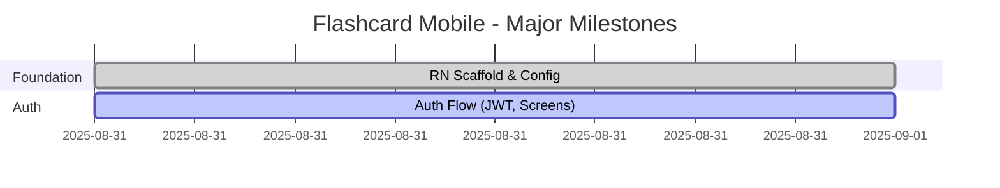

# Mobile App Progress

This document tracks major milestones for the React Native app. Minor UI tweaks and bug fixes are excluded from the Gantt chart per notes.

## Log

- 2025-09-11: UI enhancements — added centered logo to Login/Register (`src/logo.png` via static require); wrapped auth screens in `KeyboardAvoidingView` + `ScrollView` to prevent keyboard overlap; updated `ModalBase` to avoid keyboard across all modal forms.
- 2025-08-31: Expo TS scaffold under `React-Native/` with navigation and auth context.
- 2025-08-31: Implement Login, Register, and Dashboard with JWT handling and secure storage.
- 2025-08-31: UI pass for Login/Register (neo-brutalist), labeled inputs, validation.
- 2025-08-31: Integrated haptics, tap-outside keyboard dismiss, return key dismiss; added base modal with backdrop dismiss.
- 2025-08-31: Dashboard lists default decks in 2-column grid; added Default Deck detail with paginated cards and Card detail with 'Save to your deck' modal; clone default deck action wired.
- 2025-08-31: Added bottom tabs (Explore, My Decks, Account) with icons and active color; wired Explore stack to default deck/card screens.
- 2025-08-31: Card detail title now uses card name; renders image if available; Save modal shows empty state with Create Deck button; gated auth splash to avoid dashboard flicker on invalid tokens.
- 2025-08-31: Default deck review implemented (flip, hint toggle, add to deck, skip). Added 'Category: ...' labels in list and detail.
- 2025-08-31: Review UX tweaks — hint toggle only pre-flip; centered unflipped view; always show word type in title.
- 2025-08-31: Review Flip button replaced with black icon (no background).
- 2025-08-31: Implemented personal deck CRUD detail (edit/delete deck; list paginated cards; add/edit/delete cards; image URL field; placeholders for upload). Added My Decks stack navigation.
- 2025-08-31: UI icons — Edit buttons now use edit icon, Delete uses trash icon; Exit session button colored orange.
- 2025-08-31: Image upload wired — pick from device, upload to API, and instantly update card image; falls back to URL field.
- 2025-08-31: Cloudinary transformations applied for optimized images; My Card detail screen added with frequency status badge and image change action.
- 2025-08-31: Deck list images: fixed 16:9 aspect with Cloudinary c_fill; introduced colors theme and refactored screens to use it.
- 2025-08-31: Personal review scaffold — setup screen to choose methods, multi-method review player (Flashcard/MCQ/Fill), and submit logic wired to update frequency.

- 2025-09-03: Added AsyncStorage-backed caching helper and wired static endpoints (default decks/details/cards) to use cached GET with 24h TTL; falls back to stale on offline.
- 2025-09-03: Introduced React Query across user flows with persisted client; added `queryKeys` for consistent keys and invalidation.
- 2025-09-03: Migrated MyDecks, MyDeckDetail, and MyCardDetail to React Query; added invalidations after mutations (create/update/delete, image upload, archive, review submissions) for real-time accuracy across deck lists, deck details, card lists, and searches.
- 2025-09-03: Implemented live-as-you-type search in My Decks using debounced queries (300ms) + React Query with keepPreviousData and pagination; cleared manual search state logic.
- 2025-09-03: Upgraded default content screens to React Query (24h staleTime) with pull-to-refresh on lists; kept invalidations consistent across flows.
- 2025-09-03: Darkened search placeholder color for better readability using theme subtext.
- 2025-09-03: Implemented user management endpoints in-app: edit profile (PATCH /api/users/profile) and delete account (DELETE /api/users/profile) with updated AuthContext helpers, using existing color theme.

## Gantt (Major Milestones Only)

